# Hey, I'm Yuvaraj 👋

### I build systems. I teach what I know.

<table>
  <tr>
    <td width="50%" valign="top"></td>
    <td width="50%" valign="top"></td>
  </tr>
</table>

  

### 🚀 Shipped in production

- **[Certificate Verification System](https://certificates.fraylontech.com)** — QR-verified certificate issuance. Next.js + Supabase, HMAC-SHA256 tamper detection, Puppeteer PDF generation.
- **Fraylon Academy** — CS50-style LMS with automated grading. React 19 + Express + Prisma + BullMQ.
- **[Career Co-Pilot](https://github.com/yuvaraj-dudukuru/career_co-pilot)** — GenAI career roadmaps built on the Gemini API.
- **[WhatsApp Automation](https://github.com/yuvaraj-dudukuru/WhatsApp_Automation)** — bulk messaging pipeline, ~1,000 msgs/hr.

### 🧰 What I work with

### 🎓 Also

Co-Founder & COO at **Fraylon Technologies LLP**, Hyderabad — where I lead the technical side and run training programs in Python, AI/ML and web development. Final-year B.Tech in AI & Data Science.

The portrait, info card and heatmap above are generated from <a href="scripts/">scripts/</a> and refreshed daily by a GitHub Action.

